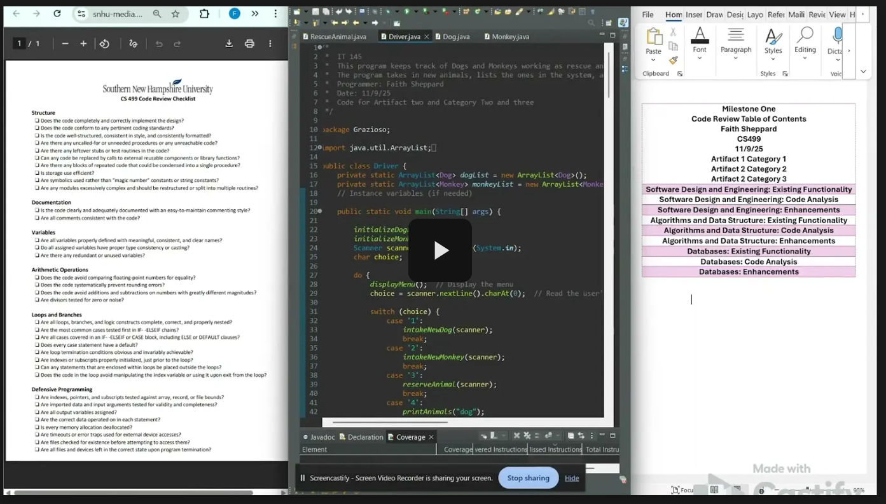

[Home](index.md) | [Code Review](CodeReview.md) | [Software Design](Enhancement-One.md) | [Algorithms](Enhancement-Two.md) | [Databases](Enhancement-Three.md)
---

---

## Code Review

---

[Watch my Code Review](https://drive.google.com/file/d/1CTPSq0v-3YGTiMK1doXizcfJ4iWIB1Gv/view?usp=sharing) to see my full plan for these enhancements based on the original code. 

Before working on any of my artifacts, I go through the existing function, check for industry standards and utilize a code review checklist, and then provide my planned enhancements and goals. An informal code review can highlight areas of improvement and evaluate changes that need to be made in order to increase the efficiency of your work as well as the quality. 

This particular code review was drafted for my professor and examined things like structure, logic, security, and purpose. I offered up my enhancement plans and detailed that I would have room for improvement based on feedback, something I would receive from peers or management in a professional setting. 

This code review is a critical step in professional development and demonstrates key skills like the ability to assess code, locate findings and communicate errors, and plan meaningful changes.
