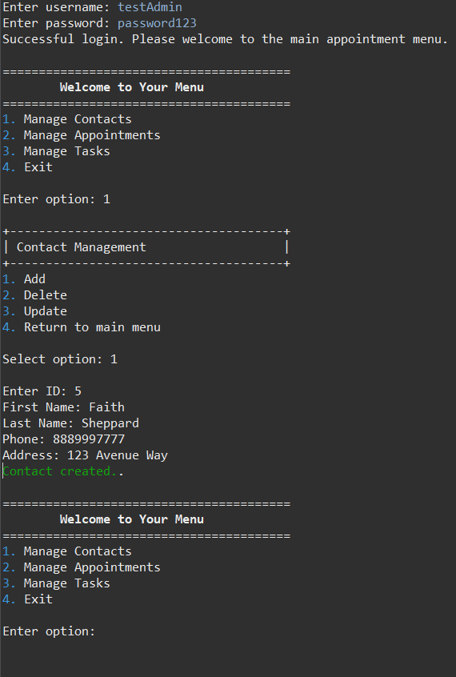

[Home](index.md) | [Code Review](CodeReview.md) | [Software Design](Enhancement-One.md) | [Algorithms](Enhancement-Two.md) | [Databases](Enhancement-Three.md)
---

---

## Enhancement One: Software Design and Engineering

---

#### Original Program
Artifact One originated from CS 320. The original program was made up of an `Appointment`, `AppointmentService`, `Contact`, `ContactService`, `Task`, and `TaskService` class with corresponding **JUnit testing** for each one. The program had no interface, held no actual data, and was focused mainly on effective testing coverage. The classes described objects and utilized CRUD methods that were the main focus of the testing coverage. The artifact at the time didn’t do much when ran beside provide the coverage result of the unit testing.

[View my original artifact here.](https://github.com/faithks/faithks.github.io/tree/Initial-Artifact-One-CS320)

#### Decisions and Enhancements
With this limited functionality of this artifact, I decided this was a great opportunity to enhance this specific project to expand its complexity and usage. I was able to have a bit of creativity with it and how I wanted to enhance it. I was able to work with incorporating the classes together for more complexity, and to provide users an actual **interface** to interact with the classes. I was also able to enhance the artifact to use **file persistence** to store the memory between uses for a more realistic approach. I also began working with **user authentication** for a more complex log in process and to make sure security was a key consideration in this enhancement. Together these improvements took this program from a testing focus to a functional application with more real-world usage and practices.

[View my enhanced artifact here](https://github.com/faithks/faithks.github.io/tree/Enhanced-Artifact-One-CS320)

---

#### Menu Screen Example

---

#### Takeaways and Learning
As I was working on creating and improving this specific artifact I was able to learn more about the best steps to take when you have no outline. Often with school projects the course is laid out to help you build from the ground up, working on the base of your project first and expanding to the next area, that makes the most sense. The course is built to keep you from having to constantly back track and re-do sections as you create your next steps. With that outline taken from me and being left to my own accord it was up to me to decide what the best course of action would be. I had to decide what to enhance and work on first to try and eliminate having to re-do the same work over and over again. I made sure to brush up on things like J Unit testing and certain Java keywords that are required for this artifact. It’s important to brush up on skills and languages you don’t utilize often to ensure you’re able to still work with them and don’t fall behind on ever changing practices and languages. 

#### Skills Demonstrated
- Object-oriented design
- Encapsulation
- Modular architecture
- File based data persistence
- User authentication and basic security practices
- Unit testing with JUnit
- Code refactoring and maintainability

#### Course Outcomes Met
- Course outcome 5: Develop a security mindset that anticipates adversarial exploits in software architecture and designs to expose potential vulnerabilities, mitigate design flaws, and ensure privacy and enhanced security of data and resources
- Course outcome 4: Demonstrate an ability to use well-founded and innovative techniques, skills, and tools in computing practices for the purpose of implementing computer solutions that deliver value and accomplish industry-specific goals

