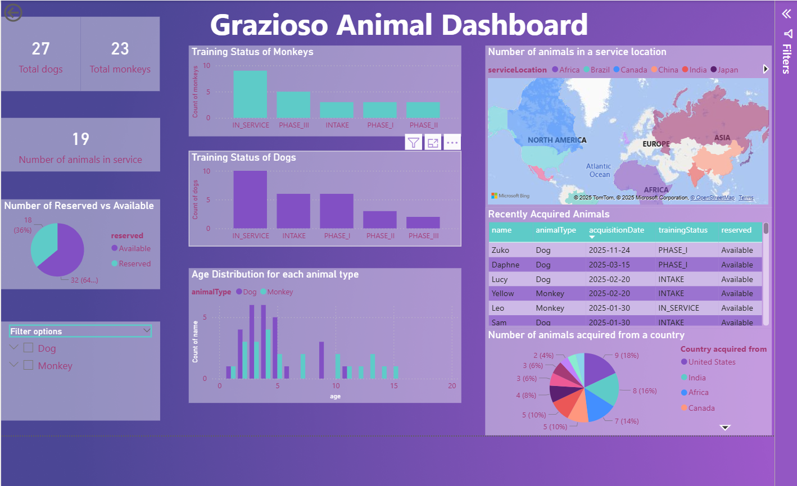

[Home](index.md) | [Code Review](CodeReview.md) | [Software Design](Enhancement-One.md) | [Algorithms](Enhancement-Two.md) | [Databases](Enhancement-Three.md)
---

---

## Enhancement Three: Databases

---

#### Original Program
The artifact for enhancement three is the same one chosen for enhancement two, the rescue animal management application. I started enhancement three after the updates were made from enhancement two including structural and algorithmic improvements like `HashMap` storage, better search and filtering, and refining variables. This cleaned up version is what I went in with to begin my work on enhancement three allowing me to focus solely on database design and analysis rather than restructuring an application again. 

[View my original artifact here.](https://github.com/faithks/faithks.github.io/tree/Initial-Artifact-Two-IT145)

#### Decisions and Enhancements
I decided to utilize the same artifact for both categories as I felt I would be able to blend the algorithm and data structures with a new database, and it would allow me to spend more time analyzing the data in **Power BI**. I wanted to keep most of my searching and filtering done through the hash maps and wanted my database focus to be on my ability to create and initialize one for data that had so many different attributes, and on my ability to analyze the data and present it to others. I created a **schema** capable of handling the intake of animals and data and connected the application to an **SQLite database**. I had to configure the database driver and ensure the application would communicate accurately with the database using **queries**.

In addition to including a database I focused on analyzing and presenting the data through Power BI. By creating a dashboard like this I’m able to provide visual communications to my audience with our data and allow the environment to be more collaborative by letting others in different fields see and utilize the data for decision making. It shows I can transform raw data into meaningful insights and visuals. 

[View my enhanced artifact here.](https://github.com/faithks/faithks.github.io/tree/Enhanced-Artifact-Two-IT145)

[Download my Power BI dashboard here.](https://github.com/faithks/faithks.github.io/blob/Dashboard-Artifact-Two/Grazioso%20Animal%20Dashboard.pbix)

---

#### Dashboard Preview

---

#### Takeaways and Learning
Through this portion of my ePortfolio I was reminded of the importance of having clean data at the start to ensure that there's no hiccups in analyzing or using the data later on. I encountered challenges with database connectivity and configuration but was able to research and troubleshoot my problems. Addressing and taking on these challenges allows me to strengthen my understanding of applications and how they interact with databases and the need for careful planning from the start. This particular enhancement also aligns my skill set with my career goals in backend development and data analytics.

#### Skills Demonstrated
- Relational database design
- Schema creation
- SQLite integration and connectivity
- CRUD operations
- Data cleaning and preparation
- Data visualization and analytics using Power BI
- Translating data into insights

#### Course Outcomes Met
- Course outcome 2: Design, develop, and deliver professional-quality oral, written, and visual communications that are coherent, technically sound, and appropriately adapted to specific audiences and contexts
- Course outcome 1: Employ strategies for building collaborative environments that enable diverse audiences to support organizational decision making in the field of computer science

