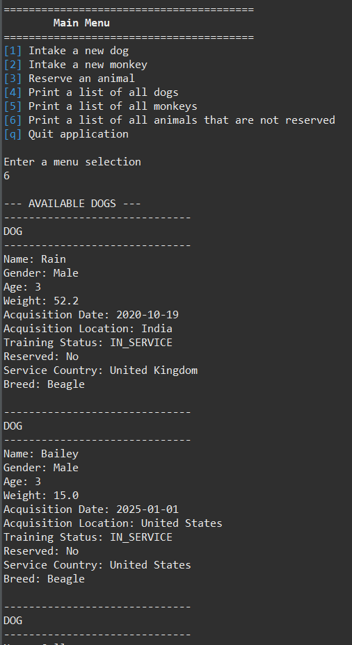

[Home](index.md) | [Code Review](CodeReview.md) | [Software Design](Enhancement-One.md) | [Algorithms](Enhancement-Two.md) | [Databases](Enhancement-Three.md)
---

## Enhancement Two: Algorithms and Data Structure
#### Original Program
Artifact Two originated from IT 145. The purpose of the original program was to manage the intake of rescue animals and their reservations. The program stored the dogs and monkeys in separate `ArrayList` and allowed users to reserve them or print lists based on either animal type or availability. This artifact was functional and included a small menu and a couple of animals that were hard coded in for testing purposes. It offered limited search options and wouldn't scale efficiently with a large dataset.

[View my original artifact here.](https://github.com/faithks/faithks.github.io/tree/Initial-Artifact-Two-IT145)

#### Decisions and Enhancements
I decided to use this artifact as it would benefit from improving searching and filtering and had a fairly weak structure with the data all being kept in arrays. I felt there were a lot of things that could be added to improve this, even some more basic items, to get the program to run faster and more efficiently. I was able to enhance this artifact with extra filters or search types, and I could expand to add more menu options or structuring since the animals have so many different variables needed to be stored. I was able to change quite a lot already by moving to **HashMaps with different indexes**, add **filtering** the maps, and searching through the maps for specific animals like ones that are unreserved. Changes like this reduced linear searches and shows my understanding of algorithmic complexity and appropriate data structure choices. I also did some basic code editing as well with changing variable types in anticipation of things like comparisons, and I added in an `Enum` to standardize variables which is helpful to keep the data well-structured and similar. This reduced potential errors and made the code maintainable.

[View my enhanced artifact here.](https://github.com/faithks/faithks.github.io/tree/Enhanced-Artifact-Two-IT145)

#### Takeaways and Learning
Over the course of modifying this artifact I learned how many ways there are to do the same thing while coding. Every time I thought of the way I wanted to insert something new, or change the way I previously did something, I could think of more than one path I could take. It was a little overwhelming to have so many options and to not be sure what the best one to pick was. Should I go with what would take me less time, what’s the cleanest, what’s the fastest, what’s the more diverse? I really had to decide what it is I was trying to do with the project as a whole to narrow down my choices. In previous classes you learn specific skills and are expected to utilize them in your projects, it’s not often they let you choose your own paths on how to get something done. This process strengthened my confidence in my decision making and reinforced the importance of structure and design for systems with large data quantities.

#### Skills Demonstrated
- Data structure selection and optimization
- Use of HashMap for efficient data access
- Algorithmic thinking and performance considerations
- Searching and filtering algorithms
- Code refactoring for scalability and maintainability
- Use of Enum types for data consistency
